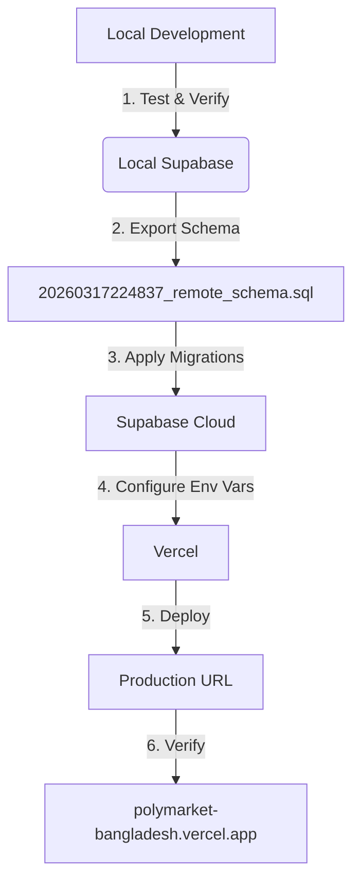

# Plokymarket Deployment Plan: Vercel + Supabase Remote

## Overview

This document outlines the deployment process for the Plokymarket prediction marketplace to Vercel (frontend) and Supabase Cloud (remote database).

---

## Current Status

### Previously Deployed (Feb 18, 2026)
- **Production URL**: https://polymarket-bangladesh.vercel.app
- **Supabase Project**: Already configured with environment variables

### Local Development Status
- ✅ Local Supabase running successfully (after fixing container issues)
- ✅ Database schema fully configured
- ✅ All migrations applied locally

---

## Deployment Components

### 1. Supabase Remote Database

The remote database needs to be synchronized with the local schema. The main migration file is:
- **`supabase/migrations/20260317224837_remote_schema.sql`** (773 KB)

#### Migration Strategy
The migrations are organized in phases:

| Phase | Description | Files |
|-------|-------------|-------|
| A | Foundation (Types, Users) | Core enums, user table |
| B | Domain Core (Events, Markets) | Event and market tables |
| C | Trading Core (Orders, Trades) | Order book, trade execution |
| D | Wallet & Finance | Balance management |
| E | Analytics & Leaderboard | Rankings, stats |
| F | Oracle & Admin | Market resolution |
| G | Security (RLS) | Row-level security |
| Phase 3-4 | Enhancements | v2/v3 wrapper functions |
| FINAL | Consolidation | All wrapper delegations |

#### Applying Migrations to Remote

**Option A: Via Supabase Dashboard (Recommended)**
1. Go to [Supabase Dashboard](https://app.supabase.com)
2. Select your project
3. Navigate to **SQL Editor**
4. Copy the contents from `supabase/migrations/20260317224837_remote_schema.sql`
5. Run the SQL
6. Verify with: `SELECT * FROM supabase_migrations.schema_migrations;`

**Option B: Via CLI**
```bash
# Link to remote project
npx supabase link --project-ref YOUR_PROJECT_REF

# Push migrations
npx supabase db push
```

**Option C: Using the apply script**
```bash
cd apps/web
node apply_migration_142.js
```

### 2. Vercel Frontend Deployment

#### Prerequisites
Ensure all environment variables are configured:

| Variable | Required | Description |
|----------|----------|-------------|
| `NEXT_PUBLIC_SUPABASE_URL` | ✅ | Supabase project URL |
| `NEXT_PUBLIC_SUPABASE_ANON_KEY` | ✅ | Supabase anonymous key |
| `SUPABASE_SERVICE_ROLE_KEY` | ✅ | Service role key (secret) |
| `SUPABASE_JWT_SECRET` | ✅ | JWT secret |
| `GEMINI_API_KEY` | ✅ | Google Gemini API key |
| `MASTER_CRON_SECRET` | ✅ | Secret for cron-jobs.org endpoints |
| `KV_REST_API_URL` | ✅ | Upstash Redis URL |
| `KV_REST_API_TOKEN` | ✅ | Upstash Redis token |
| `TELEGRAM_BOT_TOKEN` | Optional | Telegram bot for notifications |
| `TELEGRAM_CHAT_ID` | Optional | Telegram chat ID |

#### Deployment Commands (Vercel CLI)

```bash
# Navigate to web app
cd apps/web

# Install dependencies
npm install

# Deploy to production using Vercel CLI
vercel --prod

# Alternative: Link project and deploy
vercel link --project polymarket-bangladesh --yes
vercel --prod --yes
```

---

## Detailed Deployment Steps

### Step 1: Prepare Supabase Remote

- [ ] 1.1 Login to Supabase Dashboard
- [ ] 1.2 Navigate to SQL Editor
- [ ] 1.3 Execute `20260317224837_remote_schema.sql`
- [ ] 1.4 Verify migrations applied:
  ```sql
  SELECT version, name FROM supabase_migrations.schema_migrations ORDER BY executed_at DESC LIMIT 10;
  ```
- [ ] 1.5 Run seed data (optional):
  ```sql
  -- Execute contents of supabase/seeds/018_sample_bangladesh_data.sql
  ```

### Step 2: Configure Vercel Environment

- [ ] 2.1 Go to Vercel Dashboard
- [ ] 2.2 Select project: `polymarket-bangladesh`
- [ ] 2.3 Navigate to Settings → Environment Variables
- [ ] 2.4 Add all required variables (see table above)
- [ ] 2.5 Ensure `NEXT_PUBLIC_SUPABASE_URL` points to remote (not local)

### Step 3: Deploy Frontend

- [ ] 3.1 Run deployment command
- [ ] 3.2 Wait for build to complete
- [ ] 3.3 Note deployment URL

### Step 4: Verify Deployment

- [ ] 4.1 Visit production URL
- [ ] 4.2 Test user registration/login
- [ ] 4.3 Verify Supabase connection (check network tab)
- [ ] 4.4 Test admin panel access
- [ ] 4.5 Verify market data loads

### Step 5: Post-Deployment Setup

- [ ] 5.1 Configure cron-jobs.org for 18 automated workflows:
  - Add each workflow endpoint at https://cron-jobs.org
  - Use `MASTER_CRON_SECRET` header for authentication
  - See the "Workflows Configuration" section for endpoint details
- [ ] 5.2 Test workflow triggers from admin panel
- [ ] 5.3 Set up Telegram notifications (if desired)

---

## Deployment Diagram



---

## Troubleshooting

### Build Errors
```bash
cd apps/web
npm install
npm run build
```

### Environment Variables Missing
```bash
vercel env pull
```

### View Deployment Logs
```bash
vercel logs --production
```

### Database Connection Issues
1. Verify `NEXT_PUBLIC_SUPABASE_URL` is correct (not localhost)
2. Check Supabase project status in dashboard
3. Ensure IP whitelist allows Vercel IPs

### Check Migration Status
```sql
-- In Supabase SQL Editor
SELECT * FROM supabase_migrations.schema_migrations ORDER BY executed_at DESC;
```

---

## Next Steps After Deployment

1. **Monitor** - Check Vercel deployment dashboard for errors
2. **Test** - Verify all features work in production
3. **QStash** - If upgrading to paid plan, set up automated workflows
4. **Analytics** - Monitor user activity and system performance

---

## Notes

- **Workflow Scheduling**: Using **cron-jobs.org** (not QStash) for 18 automated workflows
- **Deployment Method**: Vercel CLI (`vercel --prod`)
- The production deployment from Feb 18, 2026 already has all features
- This deployment updates the database schema to match local development
- Local Supabase uses PostgreSQL 17, ensure remote matches
- Studio is disabled in local config (`enabled = false`) - this is intentional

---

## Workflows Configuration (cron-jobs.org)

The project uses **18 automated workflows** via cron-jobs.org:

| # | Workflow | Cron Schedule |
|---|----------|---------------|
| 1 | Leaderboard Update | Daily midnight |
| 2 | Crypto Market Data | Every 5 min |
| 3 | News Market Data | Daily 12PM |
| 4 | Analytics Daily | Hourly |
| 5 | Tick Adjustment | Hourly |
| 6 | Sports Data | Every 10 min |
| 7 | Dispute Workflow | Every 6 hours |
| 8 | Daily AI Topics | Daily midnight |
| 9 | Check Escalations | Every 5 min |
| 10 | Batch Markets | Every 15 min |
| 11 | Exchange Rate Update | Every hour |
| 12 | Market Price Sync | Every 15 min |
| 13 | User Activity Sync | Daily |
| 14 | Notification Cleanup | Daily |
| 15 | Archive Old Data | Weekly |
| 16 | Health Check | Every 5 min |
| 17 | Cache Warming | Every 10 min |
| 18 | Report Generation | Daily 1AM |

### Setting up cron-jobs.org
1. Create account at https://cron-jobs.org
2. Add each workflow endpoint as a cron job
3. Use the `MASTER_CRON_SECRET` header for authentication

Example endpoint:
```
POST https://polymarket-bangladesh.vercel.app/api/cron/workflow-name
Headers: { "x-master-cron-secret": "your-secret" }
```
