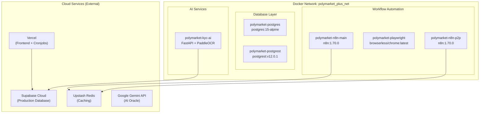
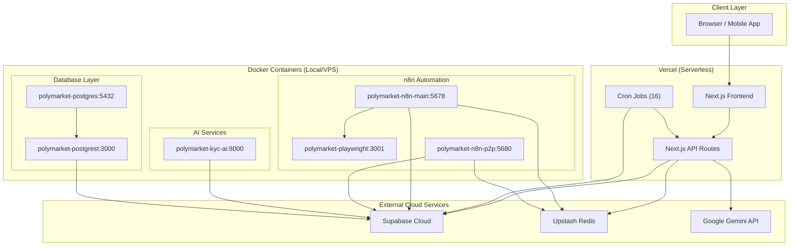

# Plokymarket Production Readiness: Containers & Workflows Inventory

## Overview

This document provides a comprehensive inventory of all Docker containers and automation workflows required for Plokymarket's production deployment. It categorizes each component by type, describes its function, and identifies the infrastructure layer it belongs to.

---

## Part 1: Docker Containers

### Architecture Diagram



---

### 1. Database Layer

#### 1.1 polymarket-postgres

| Attribute | Value |
|-----------|-------|
| **Image** | `postgres:15-alpine` |
| **Container Name** | `polymarket-postgres` |
| **Purpose** | PostgreSQL 15 relational database |
| **Restart Policy** | `unless-stopped` |
| **Data Volume** | `supabase-data:/var/lib/postgresql/data` |
| **Port** | `5432` |
| **Health Check** | `pg_isready -U postgres` |

**Functions:**
- Stores all application data (users, markets, orders, trades, wallets)
- Provides ACID transactions for financial operations
- Hosts database functions and stored procedures
- Enables Row Level Security (RLS) for access control
- Supports PostgREST for auto-generated REST API

---

#### 1.2 polymarket-postgrest

| Attribute | Value |
|-----------|-------|
| **Image** | `postgrest/postgrest:v12.0.1` |
| **Container Name** | `polymarket-postgrest` |
| **Purpose** | Auto-generated REST API from PostgreSQL schema |
| **Restart Policy** | `unless-stopped` |
| **Port** | `3000` |
| **Depends On** | `polymarket-postgres` (healthy) |

**Functions:**
- Auto-generates RESTful API from PostgreSQL tables
- Enforces Row Level Security policies automatically
- Provides CRUD operations for all tables
- Supports filtering, pagination, and sorting
- Delivers data in JSON format for frontend consumption

---

### 2. Workflow Automation (n8n)

#### 2.1 polymarket-n8n-main

| Attribute | Value |
|-----------|-------|
| **Image** | `docker.n8n.io/n8nio/n8n:1.70.0` |
| **Container Name** | `polymarket-n8n-main` |
| **Purpose** | Primary workflow engine for business automation |
| **Restart Policy** | `unless-stopped` |
| **Port** | `5678` |
| **Data Volume** | `n8n_data:/home/node/.n8n` |

**Functions:**
- Executes core business workflows (deposits, withdrawals, KYC)
- Automates notification delivery (Telegram, Email)
- Processes scheduled tasks (daily reports, analytics)
- Integrates with external APIs (news, sports, crypto feeds)
- Manages webhook listeners for external triggers
- Stores workflow executions and audit logs

**Key Workflows:**
- Manual deposit processor
- KYC document verification
- News scraper
- Market resolution oracle

---

#### 2.2 polymarket-playwright

| Attribute | Value |
|-----------|-------|
| **Image** | `browserless/chrome:latest` |
| **Container Name** | `polymarket-playwright` |
| **Purpose** | Browser automation for web scraping |
| **Restart Policy** | `unless-stopped` |
| **Port** | `3001` |
| **Max Concurrent Sessions** | `10` |

**Functions:**
- Enables headless Chrome browser automation
- Scrapes dynamic JavaScript-heavy websites
- Captures screenshots of web pages
- Extracts data from Binance P2P pages
- Fetches content from sites without APIs
- Supports web login automation for authenticated scraping

---

#### 2.3 polymarket-n8n-p2p

| Attribute | Value |
|-----------|-------|
| **Image** | `n8nio/n8n:1.70.0` |
| **Container Name** | `polymarket-n8n-p2p` |
| **Purpose** | Isolated P2P scraping instance |
| **Restart Policy** | `unless-stopped` |
| **Port** | `5680` |
| **Data Volume** | `n8n_p2p_data:/home/node/.n8n` |
| **Authentication** | Basic Auth enabled |

**Functions:**
- Dedicated Binance P2P price scraping
- bKash and Nagad rate monitoring
- Isolated environment for financial data extraction
- Auto-refresh exchange rates every 3 minutes
- Caches scraped data to Supabase

---

### 3. AI Services

#### 3.1 polymarket-kyc-ai

| Attribute | Value |
|-----------|-------|
| **Image** | Custom Build (`./apps/ai-kyc`) |
| **Container Name** | `polymarket-kyc-ai` |
| **Purpose** | KYC document verification with OCR |
| **Restart Policy** | `unless-stopped` |
| **Port** | `8000` |
| **Framework** | FastAPI + PaddleOCR |

**Functions:**
- Optical Character Recognition (OCR) on ID documents
- Extracts data from NID, passports, birth certificates
- Validates document authenticity (basic checks)
- Face matching verification (future enhancement)
- Stores verification results in SQLite database
- Provides REST API for verification requests

---

### Container Summary Table

| # | Container Name | Image | Port | Purpose | Restart |
|---|----------------|-------|------|---------|---------|
| 1 | polymarket-postgres | postgres:15-alpine | 5432 | Database | unless-stopped |
| 2 | polymarket-postgrest | postgrest:v12.0.1 | 3000 | REST API | unless-stopped |
| 3 | polymarket-n8n-main | n8n:1.70.0 | 5678 | Main Workflow | unless-stopped |
| 4 | polymarket-playwright | browserless/chrome:latest | 3001 | Browser Automation | unless-stopped |
| 5 | polymarket-n8n-p2p | n8n:1.70.0 | 5680 | P2P Scraper | unless-stopped |
| 6 | polymarket-kyc-ai | Custom FastAPI | 8000 | KYC Verification | unless-stopped |

---

## Part 2: n8n Workflows

### Location: `automation/workflows/`

#### 2.1 ai_oracle_resolution.json

| Attribute | Value |
|-----------|-------|
| **Workflow Name** | Plokymarket AI Oracle Resolution |
| **Trigger** | Webhook (`plokymarket-resolution`) |
| **Method** | POST |
| **Tags** | plokymarket, oracle |

**Function:**
AI-powered market resolution that analyzes news sources and determines outcomes for prediction markets.

**Process Flow:**
```
Webhook → Extract Market Data → Google Search
                                  ↓
                          News API Search
                                  ↓
                          Combine Sources
                                  ↓
                          Gemini AI Analysis
                                  ↓
                          Parse AI Response
                                  ↓
                    Send Result to Plokymarket
                                  ↓
                       Respond to Webhook
```

**Key Features:**
- Multi-source web search (Google, NewsAPI)
- Bangladeshi news sources (Prothom Alo, The Daily Star, BD News 24, Bangla Tribune)
- Gemini AI analysis with confidence scoring
- Complete audit trail with sources
- Weighted consensus calculation

---

#### 2.2 binance_p2p_scraper.json

| Attribute | Value |
|-----------|-------|
| **Workflow Name** | Binance P2P Scraper (Advanced) |
| **Trigger** | Webhook (`scrape-binance-p2p`) |
| **Method** | POST |
| **Data Cache** | `p2p_seller_cache` table |

**Function:**
Scrapes real-time USDT exchange rates from Binance P2P marketplace for bKash and Nagad payment methods.

**Process Flow:**
```
Webhook → Input Validation → HTTP Request (Scraping)
                                        ↓
                                  Data Extraction
                                        ↓
                              Supabase Cache
```

**Supported Methods:**
- bKash (Bangladesh mobile wallet)
- Nagad (Bangladesh mobile wallet)

**Data Extracted:**
- Seller nickname
- Price in BDT
- Available USDT amount
- Transaction limits
- Completion rate
- Verification status
- Affiliate link

---

#### 2.3 manual_deposit_processor.json

| Attribute | Value |
|-----------|-------|
| **Workflow Name** | Manual Deposit Processor |
| **Trigger** | Webhook (`manual-deposit-created`) |
| **Method** | POST |

**Function:**
Processes manual USDT deposit requests with agent notification and escalation.

**Process Flow:**
```
Webhook → Notify Agent (Telegram)
              ↓
         Wait 10 Minutes
              ↓
         Check Status
              ↓
       Is Still Pending? ──→ Urgent Alert (Telegram)
```

**Key Features:**
- Instant Telegram notification to agents
- 10-minute SLA timer
- Automatic escalation if not processed
- Supports bKash, Nagad, and bank transfer
- Tracks transaction ID verification

---

#### 2.4 news_scraper.json

| Attribute | Value |
|-----------|-------|
| **Workflow Name** | News Scraper |
| **Trigger** | Schedule (Hourly) |
| **Source** | Prothom Alo RSS Feed |

**Function:**
Basic RSS-based news aggregation from Bangladeshi news sources.

**Process Flow:**
```
Schedule → Fetch RSS → XML to JSON → Split Items
```

**Source:**
- Prothom Alo English (en.prothomalo.com)

---

#### 2.5 news_scraper_advanced.json

| Attribute | Value |
|-----------|-------|
| **Workflow Name** | Advanced News Scraper (AI + Telegram) |
| **Trigger** | Schedule (Every 30 minutes) |
| **AI Model** | GPT-4o-mini |
| **Destination** | `market_suggestions` table |

**Function:**
Advanced news scraping with AI analysis to suggest new prediction market questions.

**Process Flow:**
```
Schedule → Fetch RSS → XML to JSON → Filter & Split
                                            ↓
                                      OpenAI Analysis
                                            ↓
                              ┌─────────────┴─────────────┐
                              ↓                           ↓
                        Save to Supabase           Notify Telegram
```

**Key Features:**
- Keyword filtering (election, cricket, policy, price)
- AI-powered market question generation
- Automatic database storage
- Real-time Telegram alerts to admins
- Confidence scoring for suggestions

---

#### 2.6 oracle.json

| Attribute | Value |
|-----------|-------|
| **Workflow Name** | AI Oracle |
| **Trigger** | Webhook (`resolve-market`) |
| **Method** | POST |

**Function:**
Simplified AI oracle for market resolution with source fetching.

**Process Flow:**
```
Webhook → Fetch Source → Mock AI Analysis
```

**Note:** This is a simplified version; production uses `ai_oracle_resolution.json` or Upstash workflows.

---

#### 2.7 p2p_scheduler.json

| Attribute | Value |
|-----------|-------|
| **Workflow Name** | P2P Scheduler (Auto-Refresh) |
| **Trigger** | Cron (Every 3 minutes) |
| **Target** | polymarket-n8n-p2p instance |

**Function:**
Automated scheduler that triggers P2P price scraping every 3 minutes.

**Process Flow:**
```
Cron (3 min) → ┬→ Trigger bKash Scrape
               └→ Trigger Nagad Scrape
```

**Targets:**
- bKash USDT price
- Nagad USDT price

---

### n8n Workflow Summary Table

| # | Workflow File | Name | Trigger | Purpose |
|---|---------------|------|---------|---------|
| 1 | ai_oracle_resolution.json | AI Oracle Resolution | Webhook | Market outcome AI analysis |
| 2 | binance_p2p_scraper.json | Binance P2P Scraper | Webhook | Exchange rate scraping |
| 3 | manual_deposit_processor.json | Manual Deposit Processor | Webhook | Deposit verification workflow |
| 4 | news_scraper.json | News Scraper | Hourly | Basic RSS aggregation |
| 5 | news_scraper_advanced.json | Advanced News Scraper | 30 min | AI-powered market suggestions |
| 6 | oracle.json | AI Oracle | Webhook | Simplified market resolution |
| 7 | p2p_scheduler.json | P2P Scheduler | 3 min | Auto-refresh P2P rates |

---

## Part 3: Upstash Workflows (Advanced)

### Location: `src/lib/workflows/`

The Upstash-based verification system replaces n8n for complex verification workflows.

#### 3.1 WorkflowBuilder.ts

**Function:**
Core workflow configuration system with 8 verification methods and 4 aggregation logic patterns.

**8 Verification Methods:**
| Method | Timeout | Purpose |
|--------|---------|---------|
| AI Oracle | 30s | Gemini AI analysis |
| News Consensus | 30s | Multiple news sources |
| Crypto Price Feed | 10s | Real-time prices |
| Sports API | 15s | Official results |
| Expert Voting | 5m | Domain experts |
| Community Voting | 24h | User consensus |
| Chainlink Oracle | 15s | On-chain data |
| Trusted Sources | 20s | Government/official |

**4 Aggregation Logic:**
| Logic | Description |
|-------|-------------|
| All | Every source must agree |
| Any | Any source success suffices |
| Weighted Consensus | Weighted voting (default) |
| First Success | First to reach threshold |

**6 Pre-configured Templates:**
| Template | Min Confidence | Typical Speed |
|----------|---------------|---------------|
| Crypto | 90% | 12s |
| Sports | 95% | 18s |
| Politics | 75% | 45s |
| News | 80% | 25s |
| Expert Panel | 60% | 3m |
| Community | 65% | 24h |

---

#### 3.2 UpstashOrchestrator.ts

**Function:**
Main execution engine for verification workflows using Upstash QStash.

**Key Responsibilities:**
- Parallel source execution
- Timeout enforcement (per-method configurable)
- Retry logic with exponential backoff
- Automatic escalation on failure
- Full audit trail logging
- Weighted consensus calculation
- Mismatch detection and alerting

---

## Part 4: Vercel Cronjobs

### Current Production Cronjobs

| # | Cronjob | Endpoint | Schedule | Purpose | Status |
|---|---------|----------|----------|---------|--------|
| 1 | Sync Orphaned Events | `/api/cron/sync-orphaned-events` | Daily 6:00 PM | Sync orphaned events | ✅ Active |
| 2 | Dispute Workflow | `/api/dispute-workflow` | Daily 6:00 PM | Process market disputes | ✅ Active |
| 3 | Leaderboard | `/api/leaderboard/cron` | Daily 6:00 PM | Update user rankings | ✅ Active |
| 4 | Cleanup Deposits | `/api/workflows/cleanup-expired` | Daily 6:00 PM | Cleanup expired deposits | ✅ Active |
| 5 | Daily Report | `/api/workflows/daily-report` | Daily 9:00 AM | Generate daily reports | ✅ Active |
| 6 | News Market | `/api/workflows/execute-news` | Daily 12:00 AM | Execute news markets | ✅ Active |
| 7 | Analytics | `/api/workflows/analytics/daily` | Daily 11:00 PM | Run analytics | ✅ Active |
| 8 | Auto Verify | `/api/workflows/auto-verify` | Daily 11:00 PM | Auto-verify markets | ✅ Active |
| 9 | Escalations | `/api/workflows/check-escalations` | Daily 11:00 PM | Check escalations | ✅ Active |
| 10 | Batch Markets | `/api/cron/batch-markets` | Sat 11:00 PM | Create batch markets | ⚠️ Failed |
| 11 | AI Topics | `/api/cron/daily-ai-topics` | Daily 6:00 AM | Generate AI topics | ⚠️ Failed |
| 12 | Crypto Market | `/api/workflows/execute-crypto` | Sat 12:00 PM | Execute crypto markets | ⚠️ Failed |
| 13 | Sports | `/api/workflows/execute-sports` | Sat 12:00 PM | Execute sports markets | ⚠️ Failed |
| 14 | Market Close | `/api/workflows/market-close-check` | Thu 8:00 AM | Check market closures | ⚠️ Failed |
| 15 | Price Snapshot | `/api/workflows/price-snapshot` | Wed 6:00 AM | Snapshot prices | ⚠️ Failed |
| 16 | Exchange Rate | `/api/workflows/update-exchange-rate` | Thu 8:00 AM | Update exchange rates | ⚠️ Failed |

---

### Cronjob Details

#### Daily Operations

| Cronjob | Function |
|---------|----------|
| **Sync Orphaned Events** | Synchronizes events that lost their parent market link |
| **Dispute Workflow** | Processes user disputes on market resolutions |
| **Leaderboard** | Calculates user rankings and updates scores |
| **Cleanup Deposits** | Removes expired uncompleted deposits |
| **Daily Report** | Generates platform statistics and activity report |
| **News Market** | Creates prediction markets from trending news |
| **Analytics** | Runs daily analytics on trading activity |
| **Auto Verify** | Automatically verifies markets nearing resolution |
| **Escalations** | Checks and routes escalated issues |
| **AI Topics** | Generates new market topics using AI |

#### Weekly Operations

| Cronjob | Schedule | Function |
|---------|----------|----------|
| **Batch Markets** | Saturday 11:00 PM | Creates markets in bulk |
| **Crypto Market** | Saturday 12:00 PM | Creates crypto-related markets |
| **Sports** | Saturday 12:00 PM | Creates sports event markets |
| **Market Close** | Thursday 8:00 AM | Closes markets past end date |
| **Price Snapshot** | Wednesday 6:00 AM | Records historical prices |
| **Exchange Rate** | Thursday 8:00 AM | Updates USD/BDT rates |

---

## Part 5: External Cloud Services

These services are NOT containerized but are critical infrastructure.

| # | Service | Provider | Purpose | Connection |
|---|---------|----------|---------|------------|
| 1 | Supabase Cloud | Supabase | Production database, auth, realtime | Environment variables |
| 2 | Upstash Redis | Upstash | Caching layer, workflow queue | KV_REST_API_URL, KV_REST_API_TOKEN |
| 3 | Google Gemini API | Google | AI oracle, content generation | GEMINI_API_KEY |
| 4 | Vercel | Vercel | Frontend hosting, serverless functions, cronjobs | GitHub integration |

---

## Part 6: Complete Production Architecture



---

## Part 7: Infrastructure Summary

### Containers vs Serverless

| Category | Component | Count |
|----------|-----------|-------|
| **Docker Containers** | Database, PostgREST, n8n, Playwright, KYC AI | 6 |
| **n8n Workflows** | JSON workflow definitions | 7 |
| **Upstash Workflows** | TypeScript workflow modules | 2 |
| **Vercel Cronjobs** | Serverless cron endpoints | 16 |
| **External Services** | Supabase, Upstash Redis, Gemini | 3 |

### Total Components: 34

---

## Part 8: Deployment Checklist

### Docker Containers
- [ ] polymarket-postgres (health check: `pg_isready`)
- [ ] polymarket-postgrest (health check: HTTP 200 on `/`)
- [ ] polymarket-n8n-main (health check: HTTP 200 on `/rest/health`)
- [ ] polymarket-playwright (health check: WebSocket connection)
- [ ] polymarket-n8n-p2p (health check: HTTP 200 on `/rest/health`)
- [ ] polymarket-kyc-ai (health check: HTTP 200 on `/health`)

### n8n Workflows (Import into n8n)
- [ ] ai_oracle_resolution.json
- [ ] binance_p2p_scraper.json
- [ ] manual_deposit_processor.json
- [ ] news_scraper.json
- [ ] news_scraper_advanced.json
- [ ] oracle.json
- [ ] p2p_scheduler.json

### Upstash Workflows (Deploy to Vercel)
- [ ] WorkflowBuilder.ts
- [ ] UpstashOrchestrator.ts
- [ ] API routes (4 files)

### Vercel Cronjobs (Auto-enabled)
- [ ] All 16 cronjobs configured in `vercel.json`

---

## Part 9: Port Mapping

| Service | Internal Port | External Port | URL |
|---------|--------------|---------------|-----|
| PostgreSQL | 5432 | 5432 | `localhost:5432` |
| PostgREST | 3000 | 3000 | `localhost:3000` |
| n8n Main | 5678 | 5678 | `localhost:5678` |
| Playwright | 3001 | 3001 | `localhost:3001` |
| n8n P2P | 5680 | 5680 | `localhost:5680` |
| KYC AI | 8000 | 8000 | `localhost:8000` |

---

## Part 10: Environment Variables

### Docker Containers

```env
# PostgreSQL
POSTGRES_PASSWORD=your_secure_password

# Supabase
SUPABASE_URL=https://xxx.supabase.co
SUPABASE_SERVICE_ROLE_KEY=xxx

# n8n Main
N8N_HOST=localhost
N8N_PORT=5678
N8N_PROTOCOL=https
WEBHOOK_URL=https://your-domain.com/

# n8n P2P
N8N_P2P_BASIC_AUTH_USER=admin
N8N_P2P_BASIC_AUTH_PASSWORD=xxx
BINANCE_AFFILIATE_CODE=xxx

# Upstash
KV_REST_API_URL=https://xxx.upstash.io
KV_REST_API_TOKEN=xxx

# AI
GEMINI_API_KEY=xxx
```

### Vercel Environment Variables

```env
NEXT_PUBLIC_SUPABASE_URL=xxx
NEXT_PUBLIC_SUPABASE_ANON_KEY=xxx
SUPABASE_SERVICE_ROLE_KEY=xxx
QSTASH_TOKEN=xxx
QSTASH_CURRENT_SIGNING_KEY=xxx
QSTASH_NEXT_SIGNING_KEY=xxx
GEMINI_API_KEY=xxx
KV_REST_API_URL=xxx
KV_REST_API_TOKEN=xxx
MASTER_CRON_SECRET=xxx
TELEGRAM_BOT_TOKEN=xxx
TELEGRAM_CHAT_ID=xxx
```

---

*Document Version: 1.0*
*Last Updated: 2026-03-23*
*Project: Plokymarket - Prediction Marketplace for Bangladesh*
